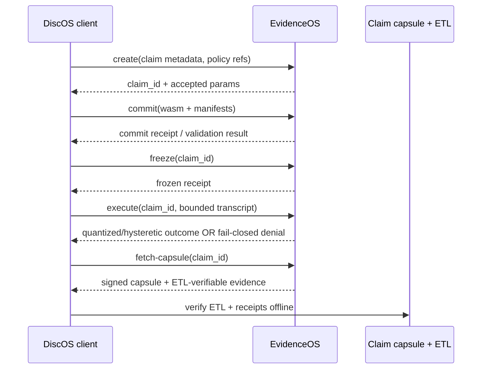

# Threat Model Worked Example: Outsider Anchor (Black-Box, End-to-End)

This walkthrough gives one concrete attack story you can hold in your head. You do **not** need to read the full paper first.

## 1) Threat in one sentence

**Adaptive probing leaks holdout labels / decision boundaries.**

## 2) Baseline system (raw-metric oracle)

Assume an outsider can call an evaluation endpoint repeatedly:

- Input: candidate predictions (or a model variant).
- Output: a raw metric such as `accuracy = 0.73125`.
- Repeats: unlimited (or effectively high enough).

In this baseline, each query returns high-resolution feedback. That makes the endpoint an information oracle, not just an evaluator.

## 3) Attacker method (bit-flip / boundary probe)

Concrete anchor scenario:

- Hidden asset: a private holdout set with binary labels.
- Goal: infer labels (or approximate the decision boundary) without direct access.

Step-by-step:

1. Submit baseline predictions and record returned accuracy.
2. Flip one prediction bit for one holdout index (or perturb one feature near boundary) and resubmit.
3. Compare new accuracy to prior accuracy.
   - If metric improves, infer one direction about true label/boundary.
   - If metric worsens, infer the opposite.
4. Repeat adaptively over indices/perturbations.
5. Aggregate deltas until hidden labels or boundary structure are reconstructed.

Because each response contains a precise scalar, tiny deltas carry real information. At scale, this is extraction.

## 4) What the attacker observes

Even as a black-box outsider, the attacker can observe:

- **Payload channel:** returned metric value(s), status fields, and any per-call metadata.
- **Timing channel:** faster/slower responses tied to branch behavior.
- **Error channel:** distinguishable error classes/messages that reveal internal state.

A robust threat model must treat all three as potential signal, not just the JSON body.

## 5) Same interaction with EvidenceOS in the loop

DiscOS still submits work, but EvidenceOS mediates and constrains what can be learned.

### Request/response flow

### Controls that change the game

EvidenceOS applies four controls at the interface boundary:

1. **Canonical realization**
   - Equivalent requests collapse to a canonical form.
   - Attackers cannot cheaply amplify leakage by syntactic re-encoding of the same probe.

2. **Quantization + hysteresis**
   - Outputs are bucketed/coarsened; tiny metric deltas are not exposed directly.
   - Hysteresis dampens threshold-chatter across near-identical adaptive queries.

3. **Budget charging / transcript cap**
   - Each interaction consumes explicit budget.
   - Transcript length is bounded; adaptive query depth is capped.

4. **Fail-closed behavior**
   - On stale proofs, policy mismatch, over-budget, or invalid state transitions, responses deny safely rather than degrade to informative partial output.

## 6) Observed outcome for the attacker

Under these constraints, the original extraction strategy loses its gradient:

- Per-query information drops sharply (coarsened outputs).
- Repeat adaptive refinement is throttled (budget + transcript cap).
- Side-channel leverage narrows (canonicalization + fail-closed discipline).

**Net effect:** attack quality collapses toward chance, or the attack becomes economically impractical before meaningful reconstruction is possible.

## 7) Scope boundaries (explicit non-goals)

EvidenceOS does **not** claim to protect against every failure mode. Out of scope includes:

- Compromised client/endpoint host (malware, key theft, local memory exfiltration).
- Stolen credentials or operator collusion.
- Upstream data poisoning that occurs before protected evaluation.
- Physical attacks and infrastructure compromise outside declared trust boundary.
- Any deployment that disables policy controls, budgeting, or verification steps.

So the promise is bounded: EvidenceOS reduces black-box adaptive leakage at the evaluation interface when deployed and operated as intended.

---

## Quick answers (if you only skim)

- **Core attack:** adaptive probing uses raw metric deltas to infer hidden labels/boundaries.
- **Why EvidenceOS helps:** canonicalization, quantization/hysteresis, budget/transcript limits, and fail-closed responses remove exploitable signal and query depth.
- **Limits:** no protection against endpoint compromise or trust-boundary violations.
